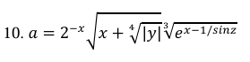
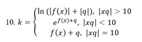
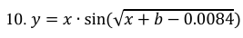

# Практическая работа №4
## 👥 Авторы
* **Ульяненко** — Разработчик
* **Гуцалюк** — Разработчик
* **Группа:** [3ИСИП-123]

---

## 📝 Описание проекта
Данное десктопное приложение разработано на платформе **WPF (Windows Presentation Foundation)**. Основная цель работы — реализация графического интерфейса для вычисления сложных математических выражений в соответствии с **Вариантом 10**.

### 🔧 Основные возможности
* **Многостраничность:** Навигация между расчетами через раздельные страницы.
* **Математический движок:** Расчет трех различных формул.
* **Валидация:** Проверка корректности ввода (обработка нечисловых данных и пустых полей).
* **Безопасность:** Обработка исключений (деление на ноль, отрицательные значения под корнем).
* **UX/UI:** Быстрая очистка полей и подтверждение выхода из программы.

---

## 📐 Вариант задания (№10)
Приложение выполняет расчет следующих функций:

1.  **Функция 1:** 
2.  **Функция 2:** 
3.  **Функция 3:** 

---

## 📂 Структура проекта
Структура файлов соответствует стандартной архитектуре WPF-приложения:

```text
Практическая_работа_4_Ульяненко_Гуцалюк/
├── Img/                            # Скриншоты формул и ресурсов
│   ├── 1.png
│   ├── 2.png
│   └── 3.png
├── Properties/                     # Свойства проекта и ресурсы
├── App.config                      # Конфигурационный файл
├── App.xaml / .cs                  # Описание приложения и точка входа
├── MainWindow.xaml / .cs           # Главное окно (контейнер для страниц)
├── Page1.xaml / .cs                # Логика и дизайн первой формулы
├── Page2.xaml / .cs                # Логика и дизайн второй формулы
├── Page3.xaml / .cs                # Логика и дизайн третьей формулы
├── Практическая_работа_4...csproj  # Файл проекта Visual Studio
├── Практическая_работа_4...sln     # Файл решения (Solution)
├── .gitattributes                  # Настройки Git
└── .gitignore                      # Исключения Git
